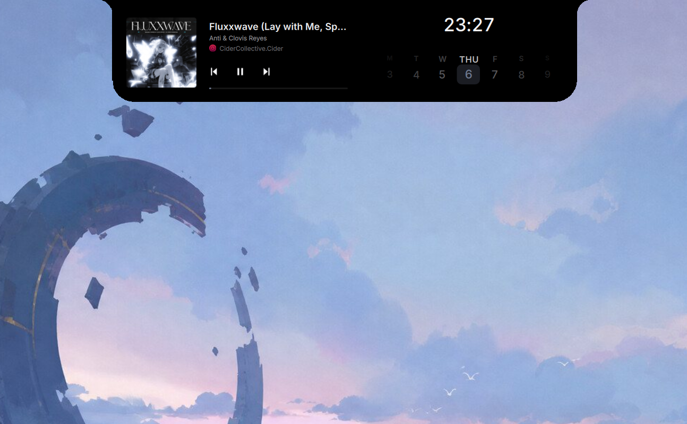

<p align="center">
  
</p>

# Ava

Ava is a native Windows 11 productivity project built with Qt 6, QML, C++, and
Win32. It ships two executables:

- **Ava** is the live-activity island, launcher, system monitor, media and timer
  surface, wallpaper controller, and optional Dwindle tiling workspace.
- **AvaChat** is a separate native Codex workspace for persistent conversations,
  approvals, attachments, diffs, and Git workflows.

Shipping features read real Windows and Codex state. Deterministic visual states
exist only for explicit screenshot QA.

## Features

### Ava island

- Compact always-on-top clock with switchable Notch and floating Pill shells.
- Optional native Liquid Glass mode with live refraction, light bending,
  chromatic dispersion, adaptive legibility, and persistent on/off state.
- `Ctrl+K` application launcher with installed-app search, launch history, an
  AvaChat entry, and direct opening of valid web addresses, files, and folders.
- Optional Monitor mode with live time, GPU and CPU utilization, battery level,
  and charging state. Selecting CPU opens CPU, memory, disk, and the five most
  active processes without exposing process IDs.
- Timer with a snapping minute ruler, compact countdown, progress ring,
  pause/resume, cancel, add-one-minute, a Windows completion alert, and a
  separate quick-action satellite while active.
- Live media title, artist, artwork, source-app icon, playback state, seekable
  timeline, transport controls, directional track handoffs, and a five-bar
  Windows output-level indicator colored from the current artwork.
- Windows Core Audio volume and mute control plus current network, battery,
  date, time, and week-calendar state.
- Local file-drop shelf with File Explorer reveal and a built-in wallpaper
  chooser using the bundled runtime wallpapers.
- Optional native Dwindle tiling with adjustable splits, live resize and swap
  feedback, title-bar drag swapping, application minimum-size handling,
  animated placement, and exact window restoration.
- Reduced-motion-aware transitions synchronized with the active display rather
  than fixed to a specific refresh rate.

### AvaChat

- Native Codex app-server client with persistent thread history, thread search,
  incremental streaming, plans, reasoning and tool activity, and explicit
  command or file-change approvals.
- Model and reasoning-effort controls populated from the active Codex account,
  plus Fast mode when the selected model supports it.
- File and image attachments, clipboard image paste, image inspection, rich
  Markdown, syntax-aware code blocks, and a dedicated diff inspector.
- Git change center for reviewing files, staging and unstaging, discarding with
  confirmation, committing, pushing, and creating pull requests.
- Optional isolated Git worktrees for new conversations.
- Single-instance activation and local IPC so Ava can surface live AvaChat
  activity in the compact island.

## Native Liquid Glass

Liquid Glass is optional and can be toggled from Ava's utility carousel. It is
applied to the island, launcher, monitor, timer, wallpaper, and related shell
surfaces. Codex surfaces remain opaque, and the separate AvaChat window stays
outside the glass rendering path.

The effect is native rather than a web or blur layer. Windows Graphics Capture
feeds live desktop content into a Direct3D 11 optical shader that performs
refraction, edge bending, dispersion, Fresnel highlights, and caustics. Shared
triple-buffered GPU textures and timeline fences keep frames off the CPU readback
path. When Explorer cannot provide usable desktop pixels, Ava resolves the
current per-monitor wallpaper instead of showing a black surface.

## Interaction

- Hover over Ava for 280 ms or click it to expand.
- Move away for 560 ms to collapse, unless it is pinned.
- Open the utility carousel to switch shells, toggle Liquid Glass or Monitor
  mode, control sound and pinning, open wallpapers or the timer, start Codex,
  and enable Dwindle. Persistent appearance choices survive restarts.
- Press `Ctrl+K` to open the launcher. Type an application name, a valid web
  address, or an existing absolute file or folder path, then press `Enter`.
- Select the CPU percentage in compact Monitor mode to open the System Monitor
  drill-down. The click is handled without triggering the normal island
  expansion first.
- Open the timer, select a duration on the ruler, and choose **Start Timer**.
- Enable or disable Dwindle tiling from the utility controls or press `Win+Alt+T`.
- Resize a tiled window along an internal edge to adjust its split.
- Drag one tiled window by its title bar and release it over another to swap
  their positions.
- Drop a local file over Ava to add it to the temporary local file shelf.
- Hover or drag the media timeline to preview and seek when the active Windows
  media session supports playback-position changes.
- Open Codex from the utility carousel to run a focused task in the island, or
  open **AI Chat** from the launcher for the full AvaChat workspace.
- Review every requested command or file-change escalation with **Deny** or
  **Allow**. Island tasks start in `workspace-write` with approvals on request;
  Ava never bypasses the Codex sandbox.

## Codex integration

Ava and AvaChat use the installed Codex app-server over newline-delimited
JSON-RPC. Tasks are real persisted Codex threads, and both clients consume
authoritative thread, turn, item, plan, approval, error, and completion events
instead of inferring activity from terminal output.

The island intentionally stays glanceable. It can start a focused task, show the
current action and elapsed time, request approvals, interrupt work, and display
completion. **Open** launches the bundled AvaChat executable for the current
workspace when it is available. AvaChat provides the full conversation,
attachment, model, diff, and Git experience. Local IPC mirrors active AvaChat
status back to the compact island without coupling the two presentation models.

Requirements:

- Codex CLI installed and signed in.
- A Codex version that provides `codex app-server`.
- Git available on `PATH` for worktrees and the Git change center.
- An authenticated GitHub CLI (`gh`) only when creating pull requests from
  AvaChat.

By default, island tasks use Ava's current working directory or the last saved
workspace. Use `--codex-workspace` for Ava or `--workspace` for AvaChat when
launching from another directory.

## Native window behavior

Ava is a frameless Win32 tool window using `WS_EX_TOPMOST`, `WS_EX_TOOLWINDOW`,
and normally `WS_EX_NOACTIVATE`. Its native input mask follows the animated
silhouette, so transparent canvas pixels do not block applications underneath.
Keyboard activation is enabled only while the launcher or Codex task composer
needs text input, then removed when that focused surface closes.

The island remains above ordinary and borderless-fullscreen windows without
stealing focus. Exclusive DirectX fullscreen can bypass desktop composition, so
no conventional desktop overlay can guarantee visibility above every
exclusive-mode game.

## Dwindle workspace tiling

Tiling is disabled by default. When enabled, Ava arranges eligible application
windows independently on each monitor using recursive Dwindle splits. It
preserves the taskbar and island clearance while excluding minimized, tool,
owned, cloaked, topmost, fullscreen-style, and unresponsive windows.

Window placement uses short smoothstep transitions, atomic multi-window updates,
and Desktop Window Manager synchronization. Every original placement is captured
before a window moves. Disabling tiling, pressing `Win+Alt+T` again, or closing
Ava restores surviving windows to their original normal, maximized, or minimized
state.

## Build on Windows

Requirements:

- Windows 11 and a current Windows SDK with C++/WinRT headers
- Qt 6.5+ with `Concurrent`, `Core`, `Gui`, `Network`, `Qml`, `Quick`,
  `QuickControls2`, `QuickDialogs2`, `QuickLayouts`, `ShaderTools`, and `Test`
- CMake 3.21+
- Visual Studio 2022 with the C++20 MSVC toolchain

From a Qt-enabled developer shell:

```powershell
cmake -S . -B build
cmake --build build --config Release
.\build\Release\Ava.exe
.\build\Release\AvaChat.exe
```

Run the focused native suite after placing the active Qt `bin` directory and
`build/Release` on `PATH`:

```powershell
ctest --test-dir build -C Release -R "system_monitor|app_launcher|codex_models|chat_text_styler|codex_git_manager|attachment_ui" --output-on-failure
```

The authenticated live Codex test is opt-in because it uses the current account
and workspace:

```powershell
$env:AVA_RUN_LIVE_CODEX_TEST = "1"
ctest --test-dir build -C Release -R codex_live_e2e --output-on-failure
```

## Useful launch options

```powershell
.\build\Release\Ava.exe --pinned
.\build\Release\Ava.exe --timer
.\build\Release\Ava.exe --start-timer 900
.\build\Release\Ava.exe --wallpapers
.\build\Release\Ava.exe --launcher --launcher-query "example.com"
.\build\Release\Ava.exe --monitor-details
.\build\Release\Ava.exe --tiling
.\build\Release\Ava.exe --codex --codex-workspace D:\path\to\project
.\build\Release\Ava.exe --screenshot compact.png
.\build\Release\Ava.exe --expanded --screenshot expanded.png
.\build\Release\Ava.exe --motion-report motion-report.csv
.\build\Release\AvaChat.exe --workspace D:\path\to\project
.\build\Release\AvaChat.exe --workspace D:\path\to\project --new-chat --worktree
```

Generated screenshots, videos, reports, logs, build products, and IDE files are
excluded by `.gitignore`.

For local visual-regression capture,
`--codex-visual-state ready|running|approval|completed|error|compact` and
`--media-peek` are accepted only together with `--screenshot`. These states
exercise the shipping QML layout without replacing the real runtime integration.

## Project layout

- `src/main.cpp` and `src/islandcontroller.*`: Ava startup, command-line
  options, native window behavior, timers, media, audio, power, clock, file
  drops, and persisted appearance state.
- `src/applauncher.*`: installed-app discovery, `Ctrl+K`, ranked search,
  icons, launch history, and direct URL or filesystem targets.
- `src/systemmonitor.*`: asynchronous CPU, memory, disk, and process sampling.
- `src/liquidglassbackdrop.*`, `src/liquidglasscaptureworker.*`, and
  `src/liquidglasstextureitem.*`: Windows capture, native D3D11 optics,
  shared-texture synchronization, and Qt scene-graph rendering.
- `src/windowtilingmanager.*`: native Dwindle layout, global shortcut,
  resizing, swapping, filtering, animation, and restoration.
- `src/codexbridge.*`: island-side Codex tasks, AvaChat launch, and compact
  activity IPC.
- `src/codexappserverclient.*`, `src/codexchatcontroller.*`,
  `src/codexmodels.*`, `src/codexthreadsnapshotstore.*`, and
  `src/codexgitmanager.*`: AvaChat transport, orchestration, incremental
  models, bounded persistence, and Git operations.
- Root `qml/`: the island shell, launcher, expanded utilities, Monitor views,
  timer, wallpaper chooser, and compact Codex activity.
- `qml/chat/`: the separate AvaChat window, composer, conversation timeline,
  attachments, code, images, prompts, work disclosures, and diff inspector.
- `tests/`: focused native tests plus the opt-in authenticated Codex E2E.
- `assets/fonts/` and `assets/icons/`: bundled fonts, licenses, Fluent icons,
  and Ava-specific artwork.

## Support Ava

If Ava is useful to you, you can support its continued development on
[Buy Me a Coffee](https://buymeacoffee.com/e_gurl).

## License

Ava's original source code is available under the
[PolyForm Noncommercial License 1.0.0](LICENSE). You may use, study, test,
modify, and share Ava for personal and other noncommercial purposes. Commercial
use is not licensed: you may not sell Ava, include it in a paid product or
service, or otherwise use it for commercial advantage without separate written
permission from the project owner.

Because it restricts commercial use, Ava is source-available software rather
than OSI-approved open-source software. Third-party assets remain under their
own licenses listed below and are not relicensed by Ava's project license.

## Third-party assets

- Inter is distributed under the SIL Open Font License 1.1. See `assets/fonts/OFL-Inter.txt`.
- Geist Mono is distributed under the SIL Open Font License 1.1. See `assets/fonts/OFL-Geist.txt`.
- Microsoft Fluent UI System Icons are distributed under the MIT License. See
  `assets/icons/LICENSE`.
